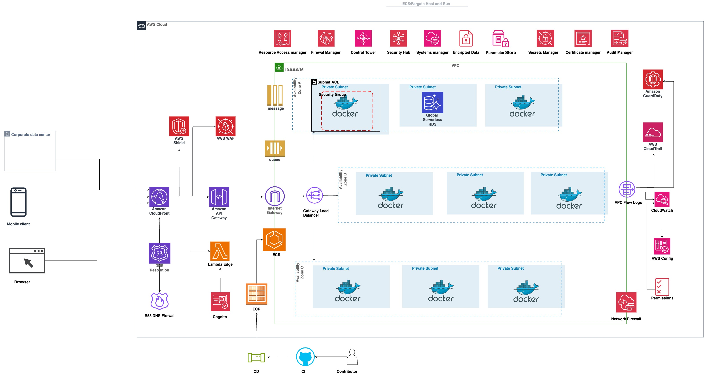

# serverless-devsecos

Serverless ECR/ECS application in acordance with AWS WAF best practices to host 

[Brief](highlights.md)

1. Problem Statement

Apply industry DevSecOps industry best practices on containerised applications hosted on AWS ECS.

2. Assumptions
   1. Production environment hosts and runs containerised applications serving traffic internally and externally
   2. IAC for ECR, ECS/Fargate, SQS/SNS, RDS
   3. CI/CD to production through stages with Unit, Functional, Integration and Penetration 
3. What
   1. Scan, monitor, observe and audit apps traffic flow for internal and external consumers.
   2. Ensure results from scan are implemented based on priority
   3. Not recommended for devs to connect to production containers, changes should go through CI/CD processes. ECS Exec is a solution for prod container access. 
4. Why?
   1. Well architected framework:
      1. CI/CD: Linting, Unit, Functional, Infrastructure, penetration, Veracode Scan and Audit
      2. Decoupling: SNS/SQS Encryption in Transit 
      3. Registry: ECR turn on scan 
      4. Compute: ECS/Fargate : Run Side car container agents in Side
      5. Networking and content delivery: VPC, CDN, DNS Firewall 
      6. Database: Serverless Global RDS - multiple DB

5. Focus areas: Security: Shift Left, Adopt Automation, Prioritise Risk Management, Integrate Security Tools, Secure Coding Standards, Enforce Access Controls, Monitor for Threats 
6. Proposal security implications: Raising current costs and lowering the risk of losing BAU processes. 
7. Considered advancements not detailed 
   1. CI/CD permissions, observability, stages and delivery strategies 
   2. Transit Gateway scenarios
   3. Kinesis and Event buss as alternatives for Decoupling
   4. Documentation & Work Procedures 
   5. Emergency Response Plans 
   6. Business Continuity Plans
   7. Disaster Recovery Plans

# Diagram

